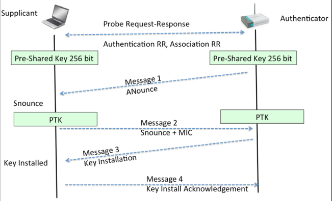

# The 4-Way Handshake in Wi-Fi (WPA/WPA2)

## Overview

The **4-way handshake** is a critical process in **WPA (Wi-Fi Protected Access)** and **WPA2** networks that establishes a secure connection between a client (e.g., laptop, smartphone) and an access point (AP). It ensures that both devices have the correct encryption keys and can communicate securely.

## Why is the 4-Way Handshake Important?

1. **Mutual Authentication** – Confirms that both the client and AP know the Pre-Shared Key (PSK)
2. **Key Exchange** – Derives unique encryption keys for the session
3. **Prevents Replay Attacks** – Uses random numbers (nonces) to ensure freshness
4. **Establishes Trust** – Both parties verify each other before exchanging data

## How the 4-Way Handshake Works

### Overview Diagram



## Detailed Step-by-Step Process

### Message 1: AP → Client (ANonce)

**What Happens:**
- The AP generates a random number: **ANonce (Authenticator Nonce)**
- This random number is sent to the client
- The client uses ANonce + PSK to start deriving the encryption key


---

### Message 2: Client → AP (SNonce + MIC)

**What Happens:**
- The client generates its own random number: **SNonce (Supplicant Nonce)**
- The client computes the **MIC (Message Integrity Code)** using the PTK (partially derived)
- Both ANonce and SNonce are sent to derive the final PTK

---

### Message 3: AP → Client (GTK + MIC)

**What Happens:**
- The AP generates the **GTK (Group Temporal Key)** for multicast/broadcast traffic
- AP sends GTK encrypted with the PTK
- Includes a new MIC for verification


---

### Message 4: Client → AP (ACK)

**What Happens:**
- Client confirms receipt of Message 3
- Sends an acknowledgment frame
- Completes the handshake
- Both sides now have identical keys


## Key Components Explained

### Nonces (Random Numbers)

**ANonce (Authenticator Nonce)**
- Generated by AP
- 256-bit random value
- Used in key derivation
- Changes for each connection

**SNonce (Supplicant Nonce)**
- Generated by client
- 256-bit random value
- Used in key derivation
- Proves client knows PSK

### Keys Generated

**PMK (Pairwise Master Key)**
```
PMK = PBKDF2-SHA1(PSK, SSID, 4096 iterations, 256 bits)
- Derived from password
- Same for all devices on same SSID
- Stored on AP for faster reconnection
```

**PTK (Pairwise Transient Key)**
```
PTK = PRF-SHA256(PMK || "Pairwise key expansion" || 
                  MIN(MAC_A, MAC_B) || MAX(MAC_A, MAC_B) ||
                  MIN(ANonce, SNonce) || MAX(ANonce, SNonce))
                  
- 384 bits total:
  ├─ KCK (128 bits) - Key Confirmation Key (MIC)
  ├─ KEK (128 bits) - Key Encryption Key
  └─ TK (128 bits) - Temporal Key (actual encryption)
```

**GTK (Group Transient Key)**
```
GTK = Random 256-bit value generated by AP
- For multicast/broadcast traffic
- Same for all clients on AP
- Sent encrypted in Message 3
- Periodically refreshed
```

### MIC (Message Integrity Code)

**Purpose:**
- Ensures message wasn't modified
- Authenticates sender
- Computed using KCK (part of PTK)

**Computation:**
```
MIC = HMAC-SHA1 or HMAC-SHA256(KCK, EAPOL_Frame)
```

**Verification:**
- Receiver computes MIC
- Compares with received MIC
- If different: attack detected, frame rejected

## Why the 4-Way Handshake Can Be Attacked

### Vulnerabilities

**1. KRACK Attack (Key Reinstallation Attack)**
- **Discovered**: 2017 by Mathy Vanhoef and Frank Piessens
- **How it works**:
  - Attacker replays Message 3
  - Forces key reinstallation
  - Can reset nonce/encryption state
  - Allows decryption of traffic

- **Prevention**:
  - Update firmware/OS
  - WPA3 resistant

**2. Offline Brute-Force Attack**
- **Process**:
  ```
  1. Capture complete 4-way handshake
  2. Try passwords from wordlist
  3. Compute PTK for each password
  4. Verify MIC against captured MIC
  5. If match: password found ✓
  ```
- **Time**: Depends on wordlist size and hardware
  - Fast wordlist: Minutes
  - Large wordlist: Hours to days

**3. Weak Passwords**
- Only 8-character passwords
- Dictionary words
- No special characters
- Easily cracked

**4. PMKID Attack**
- Capture PMKID from single frame
- No handshake needed
- Faster offline attack
- Requires single beacon frame
